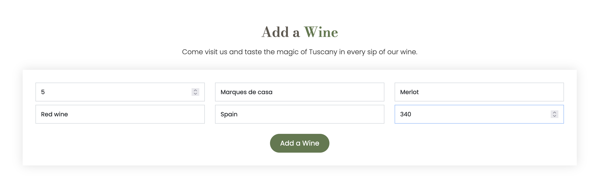
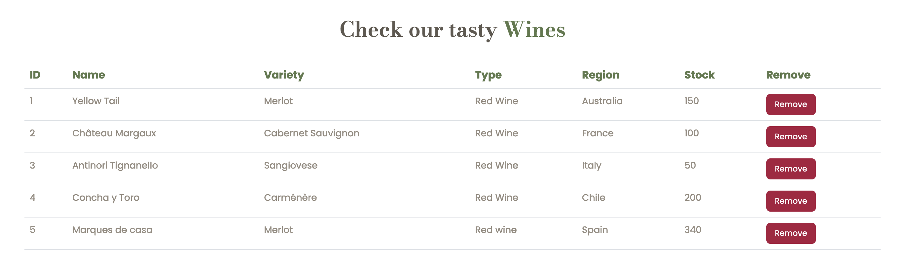
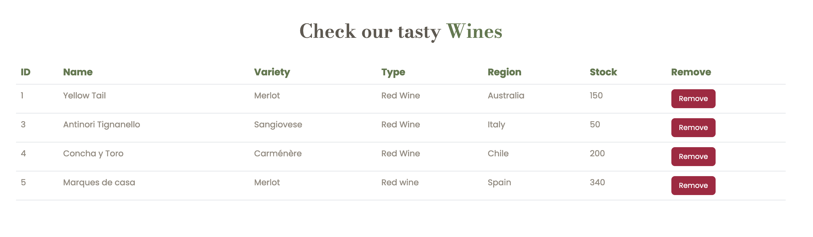

# Wine Database Vineyard

This is a Django project that manages a wine database. The project allows users to add and remove wines from the database, and displays the wine data in an HTML site.
Adding a wine is done through the form that is in the HTML site.

## Wine Model

The `Wine` model represents a type of wine that can be added to or removed from the database. The following fields are available:

- `id`: The unique identifier for this wine. This is an integer field.
- `wine_name`: The name of the wine. This is a character field with a maximum length of 255 characters.
- `wine_variety`: The variety of the wine. This is a character field with a maximum length of 255 characters.
- `wine_type`: The type of the wine. This is a character field with a maximum length of 255 characters.
- `wine_region`: The region where the wine is produced. This is a character field with a maximum length of 100 characters.
- `wine_stock`: The current stock of the wine. This is an integer field.

## URL Patterns

The following URL patterns are available:

- `/`: Displays the wine data in an HTML site.
- `/add_wine/`: Adds a new wine to the database.
- `/remove_wine/`: Removes a wine from the database.

## Views

The following view functions are associated with the URL patterns:

- `index(request)`: Displays the wine data in an HTML site.
- `add_wine(request)`: Adds a new wine to the database.
- `remove_wine(request)`: Removes a wine from the database.

## index(request)

Displays the wine data in an HTML site.

- `wine_list`: A list of all wines in the database.
- `context`: A dictionary containing the `wine_list`.
- `request`: The HTTP request that triggered this view.

Returns a rendered `index.html` template with the `wine_list` data.

## add_wine(request)

Adds a new wine to the database.

- `request`: The HTTP request that triggered this view.

If the HTTP request method is `POST`, the function extracts the wine data from the request and saves a new `Wine` object to the database. Then, it redirects the user to the `index` page.

## remove_wine(request)

Removes a wine from the database.

- `request`: The HTTP request that triggered this view.

If the HTTP request method is `POST`, the function extracts the ID of the wine to remove from the request and deletes the corresponding `Wine` object from the database. Then, it redirects the user to the `index` page.

# Form

## add_wine(request)

The form allows a user to add a wine to the database. It contains input fields for the different attributes of a wine such as `ID`, `Name`, `Variety`, `Type`, `Region` and `Stock`. 

The action attribute of the form tag specifies the URL to which the form data is submitted when the user clicks on the submit button. In this case, it is set to the URL pattern `add_wine` which is defined in the urlpatterns list of the urls.py file.

The method attribute of the form tag specifies the HTTP method used to submit the form data. In this case, it is set to POST.

Finally, the button element with type="submit" attribute creates a submit button that the user can click to submit the form data. The data is then added to the database.

# Images

## add_wine

## wine added

## remove_wine

## index
Index of the project working. Final Screenshot.

